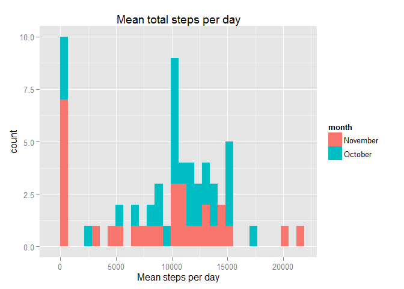
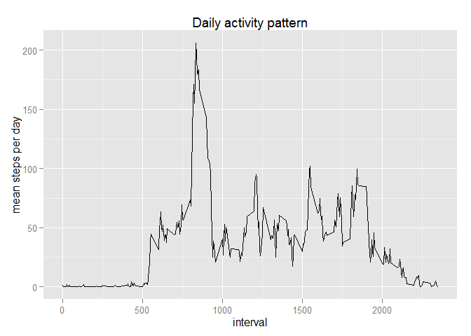
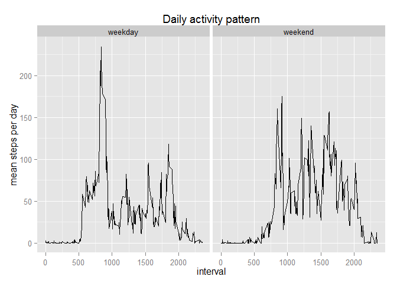

# Reproducible Research: Peer Assessment 1
Leonardo Becerra L.  
Sunday, January 18, 2015  

## Loading and preprocessing the data

###Loading required packages


```r
require(plyr)
```

```
## Loading required package: plyr
```

```r
require(dplyr)
```

```
## Loading required package: dplyr
```

```
## Warning: package 'dplyr' was built under R version 3.1.1
```

```
## 
## Attaching package: 'dplyr'
## 
## The following objects are masked from 'package:plyr':
## 
##     arrange, desc, failwith, id, mutate, summarise, summarize
## 
## The following objects are masked from 'package:stats':
## 
##     filter, lag
## 
## The following objects are masked from 'package:base':
## 
##     intersect, setdiff, setequal, union
```

```r
require(lubridate)
```

```
## Loading required package: lubridate
```

```
## Warning: package 'lubridate' was built under R version 3.1.1
```

```
## 
## Attaching package: 'lubridate'
## 
## The following object is masked from 'package:plyr':
## 
##     here
```

```r
require(ggplot2)
```

```
## Loading required package: ggplot2
```

```r
require(ggthemes)
```

```
## Loading required package: ggthemes
```

```
## Warning: package 'ggthemes' was built under R version 3.1.1
```
The first step is import the base data *activity,csv* where the original file incorporate headers and missing values are coded as NA.  
It's additionaly important to avoid the import to convert to Factors any data, and convert dates to date format.


```r
Data <- read.csv("activity.csv", header = TRUE, na.strings = NA, stringsAsFactors = FALSE)
Data$date <- strptime(Data$date, format = "%Y-%m-%d")
# Verifing properties of fields
str(Data)
```

```
## 'data.frame':	17568 obs. of  3 variables:
##  $ steps   : int  NA NA NA NA NA NA NA NA NA NA ...
##  $ date    : POSIXlt, format: "2012-10-01" "2012-10-01" ...
##  $ interval: int  0 5 10 15 20 25 30 35 40 45 ...
```


## What is mean total number of steps taken per day?

### Extracting first day and month of each Date, to be able to filter and graph variable for month and day.

```r
Data$month <- months(Data$date)
Data$day <- yday(Data$date)
```

Selecting the required data froma Data  
Grouping by day to summarize statistics by each day

```r
per_day <- select(Data, steps, day, month) %>%
        group_by(day, month) %>% 
        summarize(sum = sum(steps, na.rm = TRUE), median = median(steps, na.rm = TRUE))
```

Reporting a histogram of the mean total number of steps taken each day


```r
p <- ggplot(per_day, aes(sum, fill = month))
p + geom_histogram() + ggtitle("Mean total steps per day") + xlab("Mean steps per day")
```

```
## stat_bin: binwidth defaulted to range/30. Use 'binwidth = x' to adjust this.
```

 

Genratign and calculating the summary for mean and median numbers per day

```r
mean  <- mean(per_day$sum, na.rm = TRUE)
median  <- median(per_day$sum, na.rm = TRUE)
summary(per_day)
```

```
##       day         month                sum            median 
##  Min.   :275   Length:61          Min.   :    0   Min.   :0  
##  1st Qu.:290   Class :character   1st Qu.: 6778   1st Qu.:0  
##  Median :305   Mode  :character   Median :10395   Median :0  
##  Mean   :305                      Mean   : 9354   Mean   :0  
##  3rd Qu.:320                      3rd Qu.:12811   3rd Qu.:0  
##  Max.   :335                      Max.   :21194   Max.   :0  
##                                                   NA's   :8
```

The mean value of steps per day is 9354.2295  

The median value of steps per day is 10395  

## Are there differences in activity patterns between weekdays and weekends?

```r
per_day_interval <- select(Data, steps, day, interval) %>%
        group_by(interval) %>% 
        summarize(mean = mean(steps, na.rm = TRUE), median = median(steps, na.rm = TRUE))
```

Reporting a time series plot of the mean total number of steps taken each day


```r
q <- ggplot(per_day_interval, aes(x = interval, y = mean))
q + geom_line() + ggtitle("Daily activity pattern") + xlab("interval") + ylab("mean steps per day")
```

 

Genratign and calculating the summary for mean and median numbers per day

```r
mean_perinterval  <- mean(per_day_interval$mean, na.rm = TRUE)
median_perinterval  <- median(per_day_interval$median, na.rm = TRUE)
summary(per_day)
```

```
##       day         month                sum            median 
##  Min.   :275   Length:61          Min.   :    0   Min.   :0  
##  1st Qu.:290   Class :character   1st Qu.: 6778   1st Qu.:0  
##  Median :305   Mode  :character   Median :10395   Median :0  
##  Mean   :305                      Mean   : 9354   Mean   :0  
##  3rd Qu.:320                      3rd Qu.:12811   3rd Qu.:0  
##  Max.   :335                      Max.   :21194   Max.   :0  
##                                                   NA's   :8
```

The mean value of steps per day is 37.3826  

The median value of steps per day is 0 
## What is mean total number of steps taken per day?


## What is the average daily activity pattern?

Defining if 

```r
Data$wday = as.POSIXlt(Data$date)$wday
Data$weekday <- wday(Data$date, label = TRUE)
tail(Data, 10)
```

```
##       steps       date interval    month day wday weekday
## 17559    NA 2012-11-30     2310 November 335    5     Fri
## 17560    NA 2012-11-30     2315 November 335    5     Fri
## 17561    NA 2012-11-30     2320 November 335    5     Fri
## 17562    NA 2012-11-30     2325 November 335    5     Fri
## 17563    NA 2012-11-30     2330 November 335    5     Fri
## 17564    NA 2012-11-30     2335 November 335    5     Fri
## 17565    NA 2012-11-30     2340 November 335    5     Fri
## 17566    NA 2012-11-30     2345 November 335    5     Fri
## 17567    NA 2012-11-30     2350 November 335    5     Fri
## 17568    NA 2012-11-30     2355 November 335    5     Fri
```

```r
Data$is_wkday <- ifelse(Data$wday %in% c("6", "0"),"weekend", "weekday")
Data$is_wkday <- as.factor(Data$is_wkday)
str(Data)
```

```
## 'data.frame':	17568 obs. of  8 variables:
##  $ steps   : int  NA NA NA NA NA NA NA NA NA NA ...
##  $ date    : POSIXlt, format: "2012-10-01" "2012-10-01" ...
##  $ interval: int  0 5 10 15 20 25 30 35 40 45 ...
##  $ month   : chr  "October" "October" "October" "October" ...
##  $ day     : num  275 275 275 275 275 275 275 275 275 275 ...
##  $ wday    : int  1 1 1 1 1 1 1 1 1 1 ...
##  $ weekday : Ord.factor w/ 7 levels "Sun"<"Mon"<"Tues"<..: 2 2 2 2 2 2 2 2 2 2 ...
##  $ is_wkday: Factor w/ 2 levels "weekday","weekend": 1 1 1 1 1 1 1 1 1 1 ...
```


```r
per_day_interval_wday <- select(Data, steps, day, interval, is_wkday) %>%
        group_by(interval, is_wkday) %>% 
        summarize(mean = mean(steps, na.rm = TRUE), median = median(steps, na.rm = TRUE))
```

Reporting a time series plot of the mean total number of steps taken each day


```r
q <- ggplot(per_day_interval_wday, aes(x = interval, y = mean))
q + geom_line() + facet_wrap(~is_wkday) + ggtitle("Daily activity pattern") + xlab("interval") + ylab("mean steps per day")
```

 

Genratign and calculating the summary for mean and median numbers per day

```r
mean_perinterval  <- mean(per_day_interval$mean, na.rm = TRUE)
median_perinterval  <- median(per_day_interval$median, na.rm = TRUE)
summary(per_day)
```

```
##       day         month                sum            median 
##  Min.   :275   Length:61          Min.   :    0   Min.   :0  
##  1st Qu.:290   Class :character   1st Qu.: 6778   1st Qu.:0  
##  Median :305   Mode  :character   Median :10395   Median :0  
##  Mean   :305                      Mean   : 9354   Mean   :0  
##  3rd Qu.:320                      3rd Qu.:12811   3rd Qu.:0  
##  Max.   :335                      Max.   :21194   Max.   :0  
##                                                   NA's   :8
```

The mean value of steps per day is 37.3826  

The median value of steps per day is 0 
